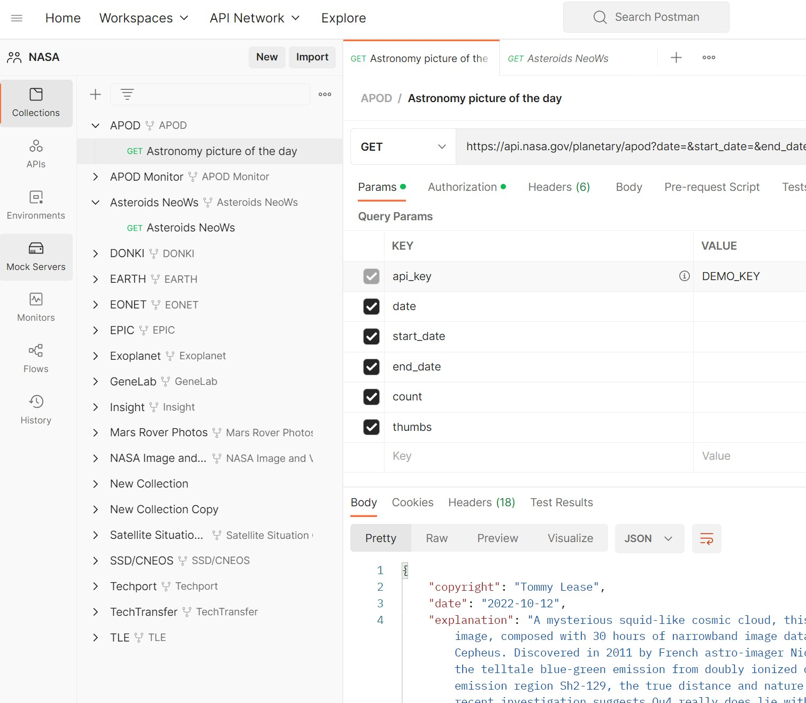
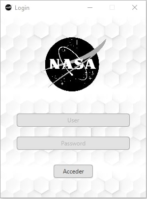
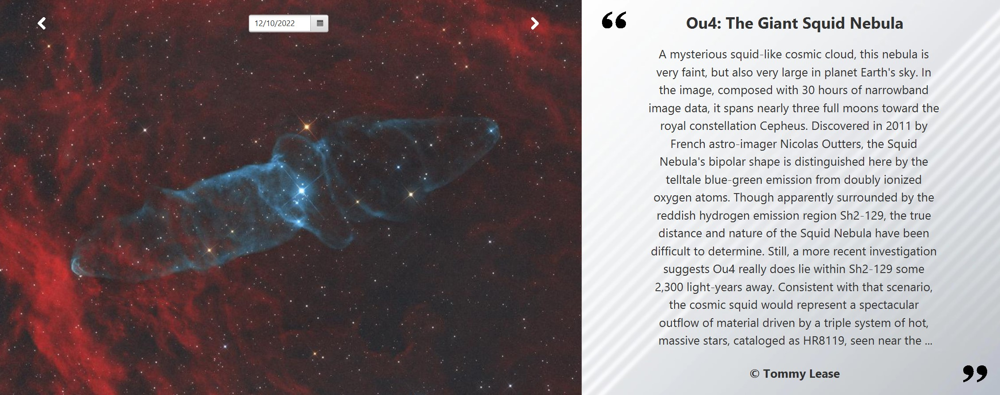
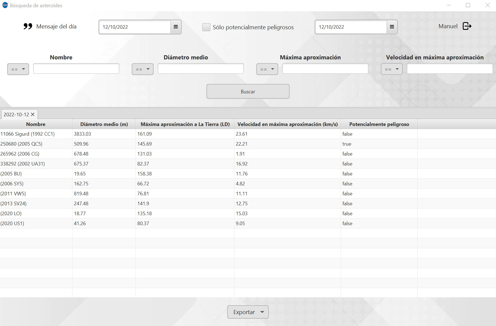
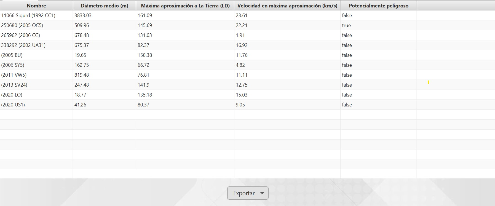
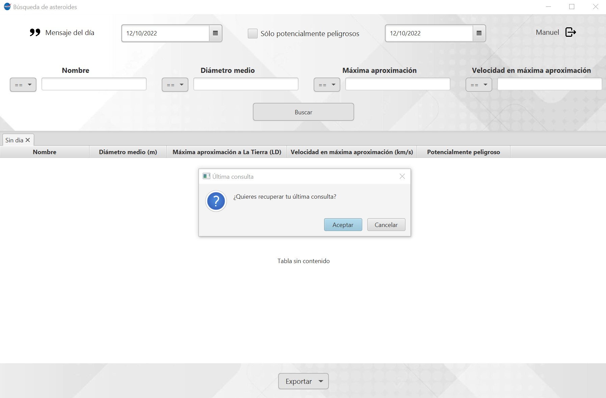

# Introducción
Este documento condensa el propósito general de la aplicación, el funcionamiento de la API utilizada,
los manuales técnico y de usuario y algunos extras y mejoras que podrían implementarse en un futuro.

### Objeto inicial
Solución a consultas actualizadas de cuerpos en órbita terrestre o extraterrestre con distancia
mínima a la Tierra (de ahora en adelante NEOs) en intervalo de tiempo inidicado. Complementos de informacion de carácter físico
y de peligrosidad.

### Utilidad
La aplicación trata de condensar en una interficie sencilla datos sobre un conjunto arbitrario de NEOs
pertenecientes al intervalo de tiempo indicado.
Es posible aplicar filtros sencillos como:
- **Nombre** del NEO
- **Diámetro medio (km)** obtenido a partir de la media aritmética entre los diámetros máximo y mínimo de las observaciones.
- **Máxima aproximación ([LD](https://es.wikipedia.org/wiki/Luna#Distancia_a_la_Luna))** del NEO a La Tierra en su periodo orbital.
- **Velocidad en máxima aproximación (km/s)**
- **Potencialmente peligroso** valora en base a parámetros no mostrados el índice de peligrosidad del NEO.

# Sobre las APIs
Se ha hecho uso del servicio [Open APIs de la NASA](https://api.nasa.gov/)
, tomando en particular datos de las APIs **APOD** y **Asterpods NeoWs**.

- **APOD** o *Astronomy Picture of the Day* es un servicio RESTful para obtener
una imagen preseleccionada por el equipo de trabajadores del JPL [SpaceRocks](https://github.com/SpaceRocks/)
Estas imágenes son actualizadas diariamente y acompañadas de frases memorables.

- **Asteroids NeoWs** es un servicio RESTful para obtener información sobre asteroides
cercanos a La Tierra.

Para la realización de pruebas previas, se ha construido la
siguiente colección de consultas en Postman:

# Manual técnico
## Estructura de clases
- **controllers**
  - `ApodController`: Controlador para las imágenes del dia.
  - `Controller`: _**(Abstracta)**_ Superclase abstracta de los controladores. Gestiona la ventana.
  - `LoginController`: Controlador para el login.
  - `MainController`: Controlador para la ventana principal.
- **daos**
  - `ApodDAO`: Conjunto de DAOs para las imágenes del dia.
  - `NeoDayDAO`: Conjunto de DAOs para los datos de asteroides.
  - `RequestDAO`: Conjunto de DAOs para las peticiones anteriores.
  - `UserDAO`: Conjunto de DAOs para los usuarios.
  - `DAO`: _**(Interfaz)**_ Tipo común para los DAO.
- **models**
  - `Apod`: Modelo para una imagen del dia.
  - `Neo`: Modelo para un asteroide.
  - `NeoDay`: Modelo para los datos de asteroides para un determinado dia.
  - `Request`: Modelo para las peticiones.
  - `User`: Modelo para los usuarios.
- **services**
  - `CypherService`: Gestiona el desencriptado de los datos de usuario.
  - `UserService`: Gestiona la autentificación y la sesión activa.
  - `SqlService`: Gestiona las conexiones a MySql.
- `Laucher`: Launcher requerido para el empaquetado en JAR.
- `Main`: Clase principal de la aplicación.
- `View`: Enumerando dónde se definen los datos de las vistas de las que consta la aplicación.

## Tecnologías y estrategias utilizadas

- `JavaFX`: Se trata de una plataforma para el desarrollo de aplicaciones para escritorio y móvil. Hace uso de FXML para la definición de las vistas.
- `Log4J`: El registro de errores se realiza mediante la dependencia Log4J, bien conocida en el entorno de Java.
- `Jackson`: Una librería para la el procesado de archivos JSon, con soporte para XML y CSV.
- `MVC`: Se ha respetado el Modelo Vista Controlador, manteniendo la lógica de la aplicación separada, tanto de las vistas como de la gestión de los datos.

## Gestión de datos de usuario

Para este proyecto se ha partido del supuesto de una aplicación de uso compartido entre varios usuarios, asumiblemente desde un mismo equipo, dada su naturaleza offline.

Dado que cada usuario deberá almacenar datos privados (En este caso su apiKey), se ha optado por almacenar dichos datos encriptados en un fichero. 

La clave de desencriptado está formada por el nombre del usuario, seguido de dos puntos y su contraseña. Por ejemplo: "usuario:contraseña". A esta string se le añadirá una salt y un vector de inicialización generados al encriptar los datos, y que constituyen los 16 y 12 primeros bytes del dato encriptado, respectivamente. Por último, el resultado de hasheará mediante el algoritmo `PBKDF2WithHmacSHA256`.

El algoritmo empleado para el encriptado ha sido `AES/GCM/NoPadding`, uno de los más recomendados actualmente.

Mediante el uso de estos mecanismos, podemos garantizar que los recursos privados de los usuarios no podrán ser descifrados si se carece de los datos de login correctos, aunque no se puede evitar la adición o eliminación de usuarios.

# Manual de usuario
## Lanzar la aplicación
Descargar la última release desde GitHub y ejecutar. El jar está totalmente autocontenido.

## Uso
Una vez lanzada la aplicación, el usuario debe iniciar sesión
con su cuenta personal.

Cada cuenta de usuario está formada por:
- Nombre de usuario
- Contraseña
- API Key personal proporcionada por el servicio de API de la NASA

### Imagen del día
Tras iniciar sesión, se muestra una ventana con la imagen del día
y una frase, pudiendo seleccionar de manera interactiva imágenes de días pasados.

El usuario puede moverse por el calendario 
a izquierda y derecha haciendo uso, respectivamente, de las teclas <kbd>A</kbd>
<kbd>D</kbd> o <kbd>&#8592;</kbd> <kbd>&#8594;</kbd>.

### Ventana principal
Haciendo clic en cualquier lugar de la imagen o pulsando las teclas <kbd>Esc</kbd> o
<kbd>Espacio</kbd>,
la imagen del día se cierra, mostrando la interfaz principal de usuario.

En esta interfaz, el usuario puede obtener información sobre los asteroides que se
encuentran en rango de máxima aproximación a la Tierra para el día seleccionado.
Las tablas admiten ordenaciones ascendente, descendente y selección de los datos.

### Filtros
Es posible aplicar una serie de filtros para mejorar las búsquedas:

| Intervalo horario       | Nombre | Diámetro | Máxima aproximación | Velocidad | Peligrosidad |
|-------------------------|--------|----------|---------------------|-----------|--------------|
| día inicial - día final | REGEX  | ==       | ==                  | ==        | &#9744;         |
|                         |        | <=       | <=                  | <=        | &#9745;        |
|                         |        | <        | <                   | <         |      |
|   |        | \>       | \>                  | \>        |      |
|     |        | \>       | \>                  | \>        |      |
|     |        | \>=      | \>=                 | \>=       |      |
|     |        | !=       | !=                 | !=         |      |

### Exportación
El usuario puede exportar los datos de búsqueda a los formatos `json` y `CSV` accediendo al
botón desplegable de la parte inferior.

### Caché de sesión
Si un usuario ya ha iniciado sesión con anterioridad, se mostrará un mensaje
con la posibilidad de cargar la última búsqueda realizada. Puede aceptarse o deshecharse
la recuperación de la sesión interactuando con la ventana o desde teclado, haciendo uso
de las teclas <kbd>Enter</kbd> y <kbd>Esc</kbd> para aceptar o rechazar, respectivamente.

# Reparto de tareas
## Manuel
- Peticiones a las API.
- Guardado de la última petición del usuario.
- Interfaces de usuario.
- Documentación readme.

## Samuel
- Gestión de usuarios.
- Acceso a datos locales.
- Exportación de ficheros.
- Interfaces de usuario.
- Documentación javadoc.

# Extras

|Extras|     |
|-----------------------------------------------------------------|-----|
|Ordenación de resultados de las consultas y almacenaje de los datos|&check;|
|Control de errores|&check;|
|Uso de la aplicación offline|&check;|
|Autentificación en la API|&check;|
|Almacenamiento del último estado de ejecución|&check;|
|Inicio de sesión de usuario|&check;|

# Posibles mejoras

Existen muchas opciones de ampliación del proyecto, pero quizás las más destacables serían:

- Permitir entrar a una nueva vista con datos más pormenorizados acerca de un asteroide (Su órbita, su mínima distancia a la tierra, etc.)
- Una opción para generar una gráfica con la evolución de los NEO a partir de los dias indicados.
- Una gestión de usuarios más completa, permitiendo crearlos o modificarlos.
- Acceder a otros recursos astronómicos; El api de la nasa tiene una gran cantidad de información interesante.

# Conclusiones

El proyecto ha terminado costando más tiempo de lo planteado, fundamentalmente por los detalles y mejoras que hemos querido añadirle, aunque todas ellas han resultado útiles para afianzar viejos y nuevos conceptos.

Opino también que ha resultado bastante instructivo el hecho de trabajar en un entorno con módulos y gestor de dependencias, a lo cual no estamos acostumbrados y, sin embargo, es el dia a dia en cualquier entorno profesional.